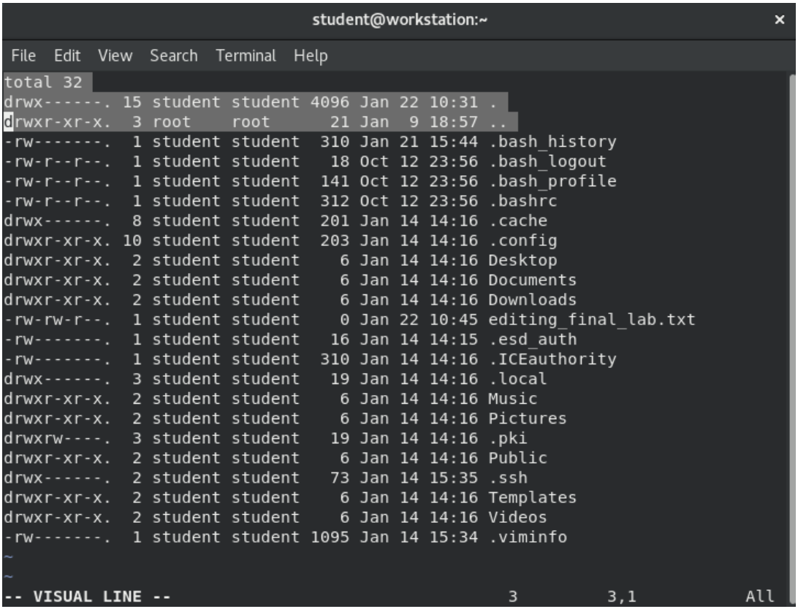
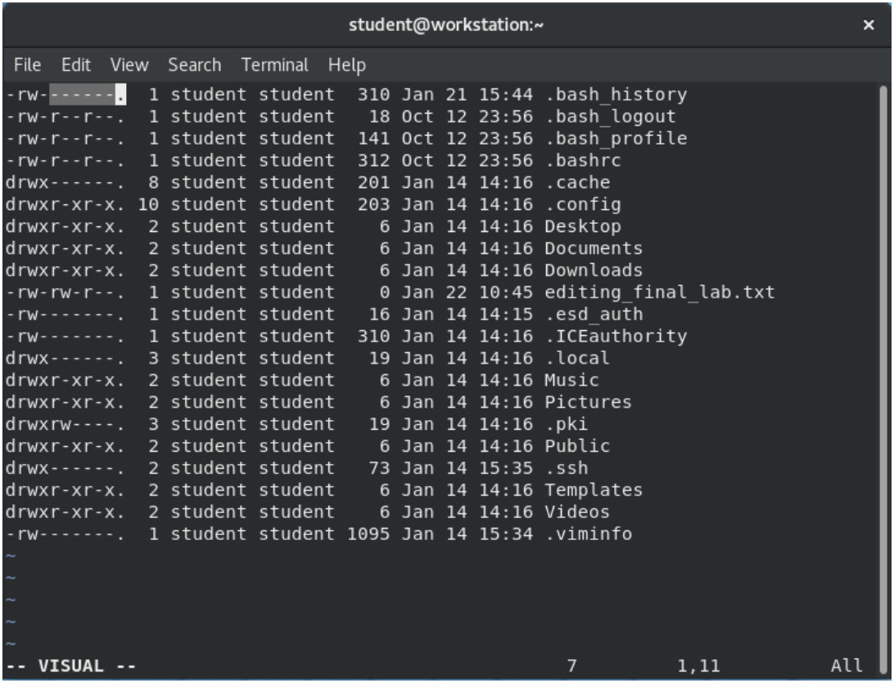
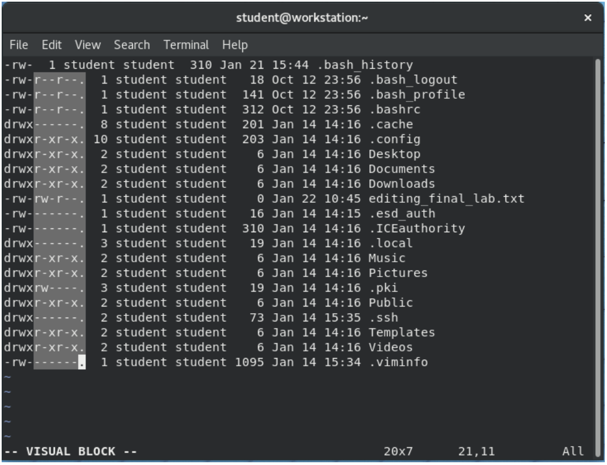
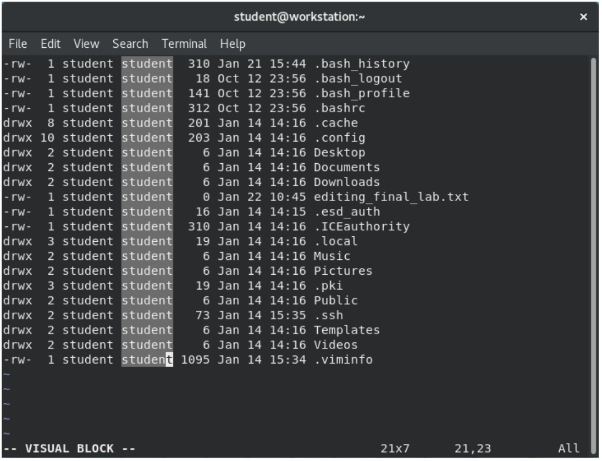
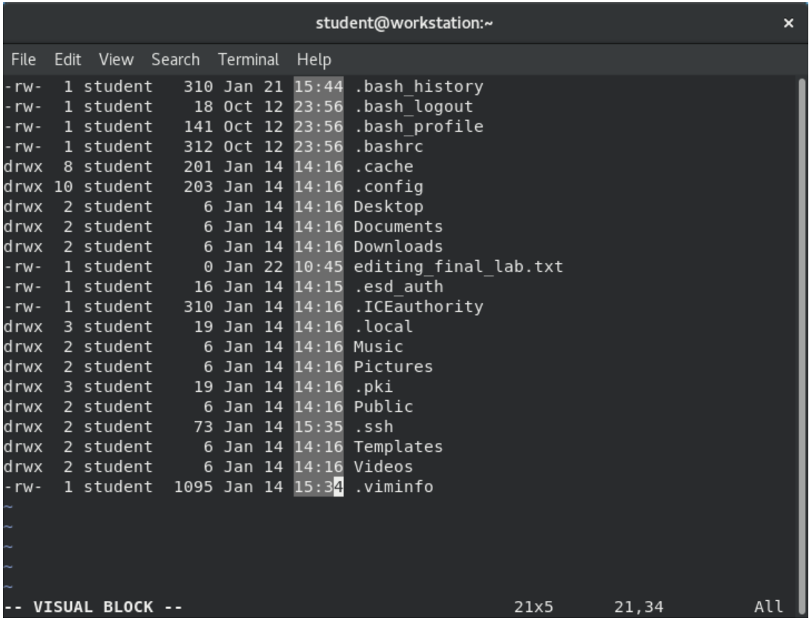

## Цели

Проверка базовых навыков использования редактора Vim

## Задачи

В этой лабораторной работе вы отредактируете текстовый файл с помощью редактора vim.

## Инструкции

Войдите на **workstation** как пользователь *student* с паролем *student*.

На **workstation** выполните команду `lab edit-review start`.

```
[student@workstation ~]$ lab edit-review start
```

1.	Перенаправьте длинный список всего содержимого из домашнего каталога пользователя *student*, включая скрытые файлы и каталоги, в файл editing_final_lab.txt.

    <details>
    <summary>Примечание</summary>
    Вывод может немного отличаться от показанных примеров.
    </details>

    На workstation в домашнем каталоге пользователя student используйте команду ls -al для перенаправления длинного списка всего содержимого в файл с именем editing_final_lab.txt.

    ```
    [student@workstation ~]$ ls -al > editing_final_lab.txt
    ```

2.	Отредактируйте файл с помощью Vim.

    2.1. Удалите первые три строки. Перейдите в строковый визуальный режим, нажав **V** в верхнем регистре.

    

    2.2. Удалите столбцы в первой строке. Перейдите в визуальный режим, нажав **v** в нижнем регистре. Строчная буква **v** выбирает символы только в одной строке. Столбцы после -rw- должны быть удалены.

    

    2.3. Удалите столбцы и последующую точку (.) в остальных строках. Используйте визуальный режим выделения блоков. Перейдите в визуальный режим выделения блоков с помощью сочетания клавиш **Ctrl+V**. Используйте эти клавиши для выбора блока символов в нескольких строках. Столбцы после -rw- должны быть удалены.

    

    2.4. Используйте визуальный режим выделения блоков, чтобы удалить четвертый столбец.

    

    2.5. Используйте визуальный режим выделения блоков, чтобы удалить столбец времени, но оставить месяц и день во всех строках.

    

    2.6. Удалите строки Desktop и Public. Перейдите в визуальный режим, нажав V в верхнем регистре.

    

    2.7. Выполните команду :wq, чтобы сохранить и закрыть файл. Создайте резервную копию, используя дату (в секундах) для создания уникального имени файла.

3. Сделайте копию файла, добавив к имени дату

    <details>
    <summary>Показать решение</summary>
    ```
    [student@workstation ~]$ cp editing_final_lab.txt editing_final_lab_$(date +%s).txt
    ```
    </details>

4.	Добавьте в файл пунктирную линию. Пунктирная линия должна содержать не менее 12 дефисов.

    <details>
    <summary>Показать решение</summary>
    ```
    [student@workstation ~]$ echo "----------------------------------------"
    >> editing_final_lab.txt
    ```
    </details>

5.	Добавьте список содержимого каталога **Documents**. Выведите список содержимого каталога на терминал и отправьте его в файл editing_final_lab.txt с помощью одной команды.

6.	Убедитесь, что указанный список содержимого находится в нижней части файла лабораторной работы.


## Оценка

На **workstation** выполните команду `lab edit-review grade`, чтобы проверить, правильно ли было выполнено упражнение.

```
[student@workstation ~]$ lab edit-review grade
```

## Конец

На **workstation** запустите сценарий `lab edit-review finish`, чтобы закончить упражнение.

```
[student@workstation ~]$ lab edit-review finish
```

Лабораторная работа завершена.
